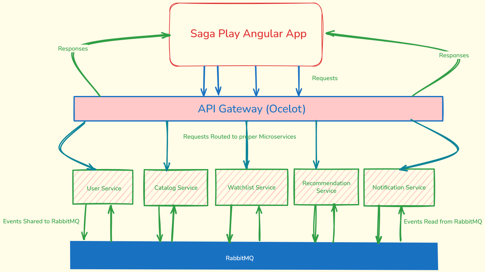

# SagaPlay
Personal Movie and TV Series tracking app built with .NET Microservices, Angular, RabbitMQ and Azure. A fun app to show what a REAL Dev can do!

---

## 🛠 Tech Stack

| Layer     | Tech                                                        |
|----------|-------------------------------------------------------------|
| Frontend | Angular (v17) + Angular Material                           |
| Backend  | .NET 8 microservices: User, Catalog, Watchlist, Recommendation, Notification |
| Messaging | RabbitMQ                                                   |
| Gateway  | API Gateway: Ocelot                                 |
| Storage  | PostgreSQL                                        |
| Cloud    | Azure App Service, Container Registry, CosmosDB/PostgreSQL  |
| CI/CD    | GitHub Actions                                              |

---

## 🧩 Architecture Overview

- Angular frontend communicates with API Gateway
- Gateway routes requests to backend microservices
- RabbitMQ handles async messaging between services
- PostgreSQL store persistent data
- CI/CD pipeline deploys to Azure

---

## 🚀 Features (planned)

✅ Track shows & movies  
✅ Add/remove items from watchlist  
✅ Mark watched episodes  
✅ Get recommendations  
✅ Email/push notifications (simulated)

---

## 🏗 How to run locally (WIP)

1. Clone repo  
2. Start RabbitMQ locally (Docker)  
3. Run backend services  
4. Start Angular app  
5. Open in browser

---

## 🌩 Cloud Deployment

- Azure App Service / Container Apps
- Free-tier PostgreSQL / CosmosDB
- CI/CD via GitHub Actions

---

## Why build this?

- Learn & demo .NET microservices in practice  
- Real RabbitMQ message handling, not toy examples  
- Show full-stack capability (Angular + .NET)  
- Deploy cloud-native app on Azure

---

> 🚀 Work in progress! Follow to see the journey.
